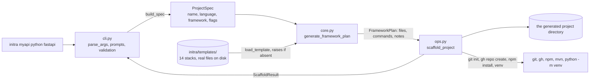

# initra

[](https://github.com/JustinK33/initra/actions/workflows/ci.yml)

A cross-platform CLI that scaffolds a working starter project for Python, Node.js, Ruby, Java, Go, or C++ from one command.


## What it does

```bash
initra myapi python fastapi
```

That creates the directory, writes framework-appropriate starter code with a health endpoint, adds a language-specific `.gitignore` and a `README.md` with real run instructions, generates the dependency file, builds a Python virtualenv, installs into it, initializes git, and commits.
Fourteen stacks work this way: Flask, FastAPI, Django, and Aiohttp for Python; Express in JS or TS, Next.js, and Koa for Node; Rails and Sinatra for Ruby; Spring Boot and Javalin for Java; Gin for Go; CMake for C++.

The point isn't breadth for its own sake. It's that every generated project has the same shape regardless of language: a health endpoint, a layered structure rather than one file, a tests directory with tests that pass, and a Dockerfile where that makes sense.
Switching languages doesn't mean relearning where things go.

Flags cover the parts you'd otherwise do by hand: `--gh` creates the GitHub repo, `--open` opens VS Code, `--ts` switches Express to TypeScript, `--dry-run` prints exactly what would be written without writing it, and `--json` prints a machine-readable summary for scripts.
Run it with no arguments and it prompts.
[USAGE.md](https://github.com/JustinK33/initra/blob/main/USAGE.md) is the full command reference.

## Tech stack

| Layer | What it uses |
| --- | --- |
| Language | Python 3.10+, standard library only |
| Terminal output | `rich` |
| Templates | Plain files under `initra/templates/`, shipped as package data |
| Tests | pytest |

One runtime dependency.
A tool whose whole job is generating other people's dependency files has no business accumulating its own.

## Architecture

Three modules, and the split is the load-bearing design decision: decide, plan, then act.



`cli.py` turns argv and interactive answers into a `ProjectSpec` and never touches the filesystem.
`core.py` turns that spec into a `FrameworkPlan`, a list of files to write and commands to run, and never touches the filesystem either.
`ops.py` is the only module that writes anything or shells out.

That's what makes `--dry-run` honest rather than a second code path: it builds the real plan and prints it instead of executing it, so a preview cannot disagree with the run it's previewing.
It's also why the tests can cover all fourteen stacks quickly, since asserting on a plan needs no `mvn` on the machine.

[WALKTHROUGH.md](https://github.com/JustinK33/initra/blob/main/WALKTHROUGH.md) traces one command through every step, and explains why `core.py` used to be 4000 lines.

## What building this taught me

**A fallback that never fires is worse than no fallback.** `core.py` carried every template twice: once as a real file under `initra/templates/` and once as an inline `DEFAULT_*` constant passed to `load_template` as a safety net. I instrumented the lookup across all 14 stacks with every combination of `--tutorial`, `--license`, and `--no-install`, and 113 of 127 lookups resolved from disk. The constants behind them were unreachable, which meant they were free to drift from the templates actually being shipped, silently. Exactly one, `java/javalin/Dockerfile`, had no packaged file, so it became a real template and the rest were deleted. `load_template` now raises `ScaffoldError` on a missing file instead of quietly writing an empty one.

**Deleting the safety net immediately exposed the bug it had been hiding, twice.** With no fallbacks, scaffolding failed outright, and it turned out `.env.example`, `.dockerignore`, and `.clang-format` were never making it into installed builds, because `templates/**/*` does not match dotfiles. Fixed with a second package-data glob. Then a clean checkout failed the same way for a completely different reason: the `.env.*` line in `.gitignore` matched `initra/templates/*/*/.env.example`, so those three files existed only on my machine and had never been committed. Published wheels were fine and fresh clones were broken, which is a difference I would not have found without removing the thing that was papering over both.

**`unittest discover` only matches `test*.py`.** `tests/templates_pytest.py` is the parametrized every-stack suite and CI was skipping it entirely while reporting a pass. Switching CI to pytest, which was already configured in `pyproject.toml`, took the test count from 43 to 77. The suite had been the strongest thing in the repo and roughly half of it hadn't run in CI for weeks.

**Order of substitution is a correctness question.** `render_readme` substituted `{{project_name}}` before injecting the plan's own text, so any placeholder inside that text survived into the finished file. Javalin shipped generated READMEs telling people to run `docker build -t {{project_name}}`. Name substitution runs last now.

**A generated project is a claim you have to check.** Templates started as one small file per stack and grew into layered structures with tests, which meant "does this scaffold" stopped being the same question as "does the result build and pass". The stack tests exist because the answer differed more than once.

## Documentation

- [QUICKSTART.md](https://github.com/JustinK33/initra/blob/main/QUICKSTART.md) is the five-minute version.
- [INSTALL.md](https://github.com/JustinK33/initra/blob/main/INSTALL.md) covers per-framework prerequisites, alternative install methods, and troubleshooting.
- [USAGE.md](https://github.com/JustinK33/initra/blob/main/USAGE.md) is the complete command reference, every flag, and the interactive walkthrough.
- [WALKTHROUGH.md](https://github.com/JustinK33/initra/blob/main/WALKTHROUGH.md) is the architecture reference: the Spec, Plan, Execution model, how the template system resolves files, and the reasoning behind both.
- [TESTING.md](https://github.com/JustinK33/initra/blob/main/TESTING.md) covers testing initra itself and verifying a generated project.
- [CONTRIBUTING.md](https://github.com/JustinK33/initra/blob/main/CONTRIBUTING.md) has the checklist for adding a new stack.
- [CHANGELOG.md](https://github.com/JustinK33/initra/blob/main/CHANGELOG.md) is the release history.

## License

MIT. See [LICENSE](LICENSE).

## Quick start

```bash
pipx install initra          # recommended
python3 -m pip install initra # also fine
```

```bash
initra myapi python fastapi
cd myapi && source .venv/bin/activate
uvicorn src.main:app --reload
```

Preview before committing to it:

```bash
initra orders-api python fastapi --dry-run --license --tutorial
```

Needs Python 3.10+ and git. Framework CLIs like `rails` and `mvn` are installed separately, `gh` only for `--gh`, VS Code only for `--open`.
`initra --list` prints the supported stacks and `initra --update` upgrades in place.

Working on initra itself:

```bash
python3 -m pip install -e ".[dev]"
python3 -m pytest tests
```

Use pytest, not `unittest discover`. The latter doesn't collect `tests/templates_pytest.py` and will report `OK` after running about half the suite.
